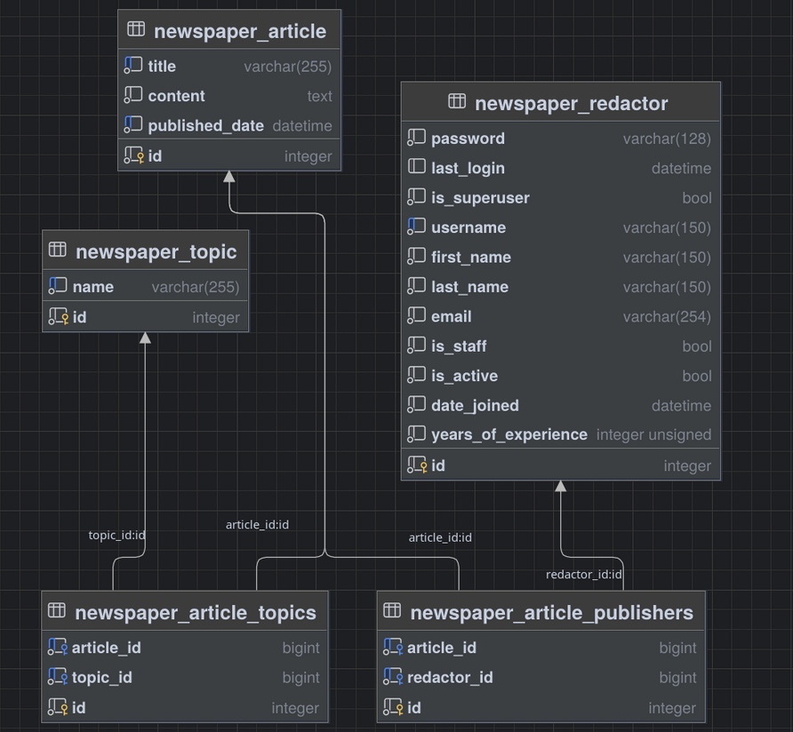

# News Agency

## 🚀 Project Overview
A web-based platform designed for managing news articles, topics, and redactors. It provides a robust system for content creation, organization, and presentation.

[News Agency Render Deploy](https://news-agency-lpk9.onrender.com)

## 🏗 Project Structure
The application is organized into the following key components:

*   **`core/`**: Contains the main Django project settings, URL configurations, and other core functionalities.
*   **`newspaper/`**: The primary application housing the core business logic, including models (Articles, Topics, Redactors), views, forms, migrations, and template tags. It also includes management commands for seeding initial data.
*   **`static/`**: Stores static assets like CSS files to control the application's appearance.
*   **`templates/`**: Contains HTML templates organized by application (`newspaper`, `registration`) and reusable components (`includes`).



## ✍️ Core Content Management Logic

### Redactors & Authentication
*   **Redactors**: The system utilizes a custom `Redactor` user model extending Django's `AbstractUser`, allowing for additional fields like `years_of_experience`.
*   **Authentication**: Implements built-in Django authentication for user login, logout, and registration.

### Articles & Topics
*   **Articles**: The main content unit, managed by `Article` models with fields for title, content, published date, and relationships to `Redactor` (publishers) and `Topic` models.
*   **Topics**: Categorize articles, allowing for better content organization and navigation.

## 🚀 Quick Start

To get the News Agency project up and running locally, follow these steps:

1.  **Clone the repository:**
    ```bash
    git clone [your-repository-url]
    cd news-agency
    ```

2.  **Create and activate a virtual environment:**
    ```bash
    python -m venv .venv
    source .venv/bin/activate
    ```

3.  **Install dependencies:**
    ```bash
    pip install -r requirements.txt
    ```

4.  **Run migrations:**
    ```bash
    python manage.py migrate
    ```

5.  **Fill the database with test data (optional but recommended):**
    ```bash
    python manage.py seed
    ```

6.  **Create a superuser (if you want admin access):**
    ```bash
    python manage.py createsuperuser
    ```

7.  **Run the development server:**
    ```bash
    python manage.py runserver
    ```

8.  Access the application in your browser at `http://127.0.0.1:8000/`.

### 🧪 Test Accounts (if `seed` command was run)

The `seed` command generates the following test accounts:

| Username           | Password                  | Role            |
|:-------------------|:--------------------------|:----------------|
| `admin`            | `StrongAdminPassword456`  | Administrator   |
| `ivan_redactor`    | `RedactorIvanPassword123` | Redactor        |
| `olga_news`        | `RedactorOlgaPassword123` | Redactor        |

*(Note: Additional random redactor accounts are generated by the `seed` command with a default password of "FakePassword123".)*